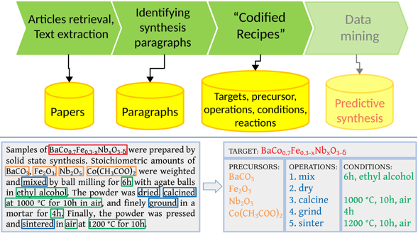

# Text-mined Synthesis

In our project on [text-mining data from literature](https://ceder.berkeley.edu/text-mined-synthesis/), we have build up a large dataset of solid-state reactions. Here, we provide our auto-generated open-source dataset of 19,744 chemical reactions retrieved from 53,538 solid-state synthesis paragraphs: text-mined dataset. The data are collected using an automated extraction pipeline (see below) which converts unstructured scientific paragraphs describing inorganic materials synthesis into so-called “codified recipe” of synthesis. The pipeline utilizes a variety of text mining and NLP approaches to find information about target materials, starting compounds, synthesis steps and conditions in the text, and to process them into chemical equation.

This repo contains necessary codes and modules built to create the solid-state reactions dataset. If you find the codes and data useful, please cite our papers:

1. Kononova, O., Huo, H., He, T., Rong Z., Botari, T., Sun, W., Tshitoyan, V. and Ceder, G., 2019. Text-mined dataset of inorganic materials synthesis recipes. Scientific Data, (submitted).
2. Huo, H., Rong, Z., Kononova, O., Sun, W., Botari, T., He, T., Tshitoyan, V. and Ceder, G., 2019. Semi-supervised machine-learning classification of materials synthesis procedures. npj Computational Materials, 5(1), p.62.

## Getting help

If you have questions about the project, please submit a issue or contact us ([cedergroup-ml-team@lbl.gov](mailto:cedergroup-ml-team@lbl.gov)). Thanks!
